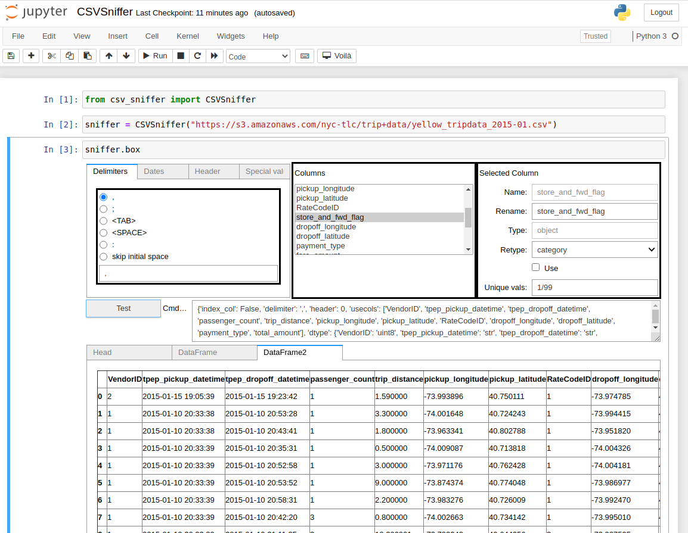

# pandas_csv_sniffer
jupyter notebook GUI for finding good parameters to the [pandas.read_csv](https://pandas.pydata.org/docs/reference/api/pandas.read_csv.html) function.

Are you able to load a csv file properly the first time using the `pandas.read_csv` function? Neither do I.
The `pandas.read_csv` function is a swiss army knife, very flexible but very complex to use right.

`pandas_csv_sniffer` provides a the jupyter notebook GUI to interactively find and tune the parameters of [pandas.read_csv](https://pandas.pydata.org/docs/reference/api/pandas.read_csv.html).

The GUI is launched with creating a  `CSVSniffer` object with a url and, optionally, other arguments you would pass to `pandas.read_csv`; if you're not sure, you can omit them.

At the first stage, the GUI first loads 100 lines form the url and tries to guess the main csv loading parameters. If it fails, the GUI shows the raw data and allows exploring interactively the suitable parameters (delimiter, doublequote, escapechar, skipinitialspace, quotechar, quoting) until the parsing succeeds.

At the second stage, once the pandas DataFrame has been loaded, the loading parameters can be tuned to omit columns, rename them, specialize their types according to the values loaded. The GUI allows interactively specifying these parameters and report the errors if they occur.

In the end, either the DataFrame can be fully loaded from the GUI with `CSVSniffer.load_dataframe()`. Alternatively, the parameters to pass to `pandas.read_csv` can be extracted with `CSVSniffer.kwargs()`.

See the `notebook` directory for examples.
